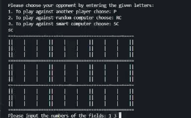

# Quantum Tic-Tac-Toe 🎮

A Python implementation of **Quantum Tic-Tac-Toe**, an advanced variation of the classic Tic-Tac-Toe game inspired by concepts from quantum mechanics such as **superposition**, **entanglement**, and **state collapse**.

Unlike traditional Tic-Tac-Toe, moves are placed in multiple positions simultaneously as *quantum moves* ("spooky marks"). These moves remain uncertain until a cyclic entanglement occurs, forcing the game state to collapse into classical marks and creating unique strategic possibilities.

---

## Features ✨

* 👥 Player vs Player mode
* 🎲 Player vs Random AI mode
* 🧠 Player vs Smart AI mode
* ⚛️ Quantum move mechanics (Spooky Marks)
* 🔄 Entanglement and Collapse System
* 🏆 Automatic Winner Detection
* 📟 Terminal-based User Interface
* 🏗️ Object-Oriented Design

---

## Technologies Used 🛠️

* Python 3
* Object-Oriented Programming (OOP)
* Game Algorithms
* Data Structures

---

## Project Structure 📂

```text
quantum-tic-tac-toe/
│
├── main.py                 # Entry point
├── board.py                # Board management and game logic
├── player.py               # Human player implementation
├── random_computer.py      # Random AI opponent
├── smart_computer.py       # Strategic AI opponent
├── quantum_gif.GIF         # Gameplay demonstration
└── README.md
```

---

## How to Run 🚀

### Clone the Repository

```bash
git clone https://github.com/lavanyaag23/Quantum-TIC-TAC-TOE--Python.git
```

### Navigate to Project Directory

```bash
cd Quantum-TIC-TAC-TOE--Python
```

### Run the Game

```bash
python main.py
```

---

## Game Modes 🎯

### Player vs Player

Two players compete against each other using quantum moves.

### Player vs Random AI

Play against a computer that makes random valid moves.

### Player vs Smart AI

Challenge an AI that evaluates collapse outcomes and attempts to maximize its chances of winning.

---

## Quantum Mechanics in the Game ⚛️

The game introduces several quantum-inspired concepts:

### Superposition

A move can exist in two board positions simultaneously.

### Entanglement

Quantum moves become linked across different board cells.

### Collapse

When a cyclic entanglement is detected, quantum states collapse into definite classical marks.

These mechanics create a deeper strategic experience than traditional Tic-Tac-Toe.

---

## Demo 🎥



---

## Future Improvements 📈

* Graphical User Interface (GUI)
* Online Multiplayer Support
* Tournament Mode
* Difficulty Levels for AI
* Game Statistics and Ranking System
* Save/Load Functionality

---

## Learning Outcomes 📚

This project helped strengthen understanding of:

* Python Programming
* Object-Oriented Design
* Game Development
* Algorithm Design
* AI Decision Making
* Problem Solving

---

## Author 👩‍💻

Lavanya Agrawal

GitHub: https://github.com/lavanyaag23

---

⭐ If you found this project interesting, consider giving it a star.


